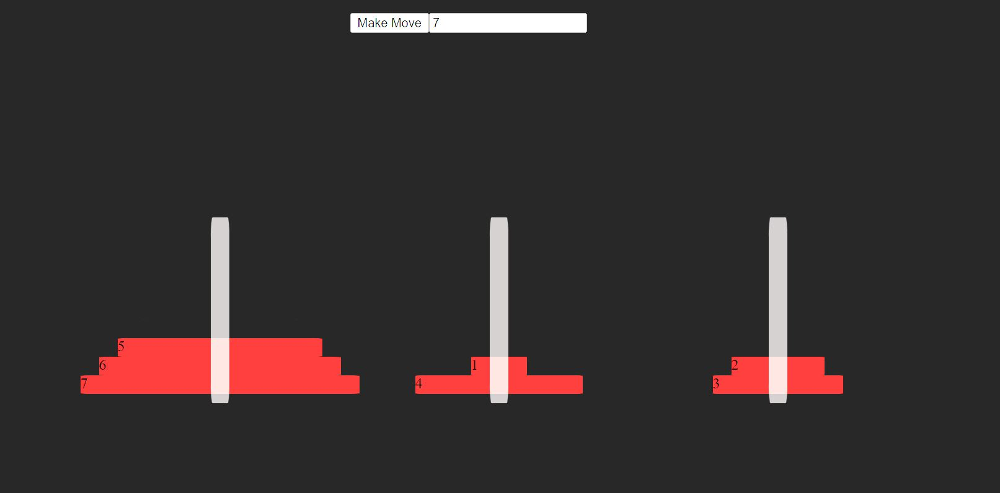

# Hanoi-Tower-MIT-Exercise
MITxPRO Exercise - Cybersecurity and Recursion

View Demo👇:  
https://hanoi-tower-mitxpor.netlify.app/

## Description
This Hanoi Tower exercise continues the focus on working with css and html but now focused on writing an algorithm for solving the Hanoi Tower puzzle. Just type in the number of disks to solve for and click through the moves with the ‘Make Move' button. This exercise used recursion in the JavaScript code to solve the puzzle since the solution process is the same regardless of the number of disks.

## How to run
Download all of the files to the same directory, making sure to keep the same file structure in place. Load the index.html file in a browser to start the program. Enter the number of disks to solve in the text box and then click the 'Make Move' button to go through the solution step by step.

## Future Improvements
Future improvements to this could be to give the user an option attempt to solve the puzzle and then see the solution.

## Licence Info
Code written by Danny Nunez using starter code from the MITxPRO full stack development bootcamp course.
